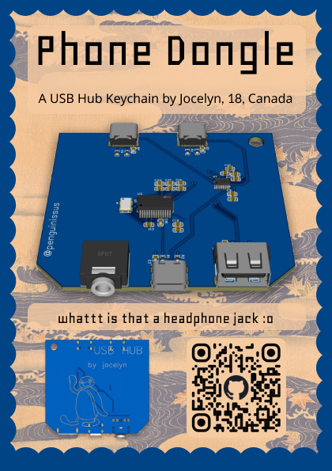
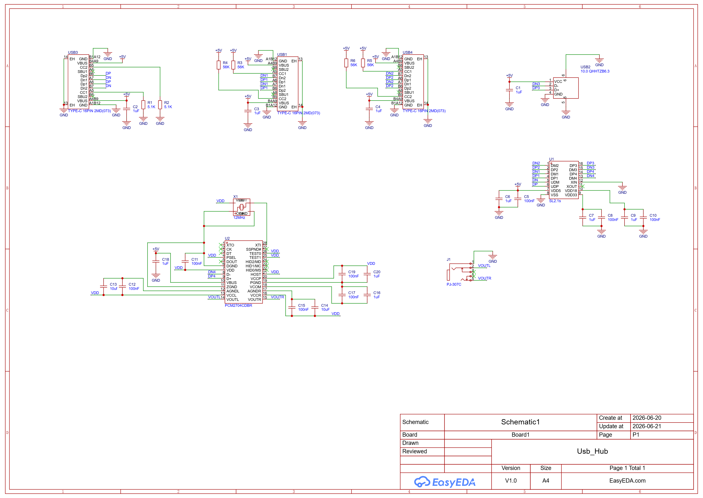
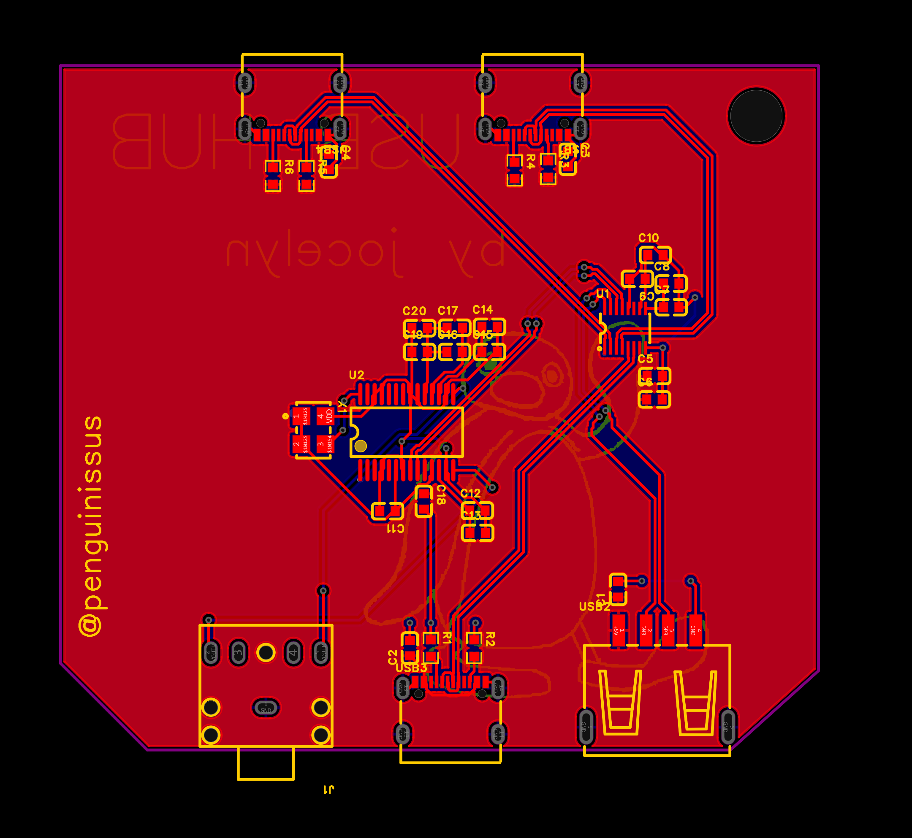
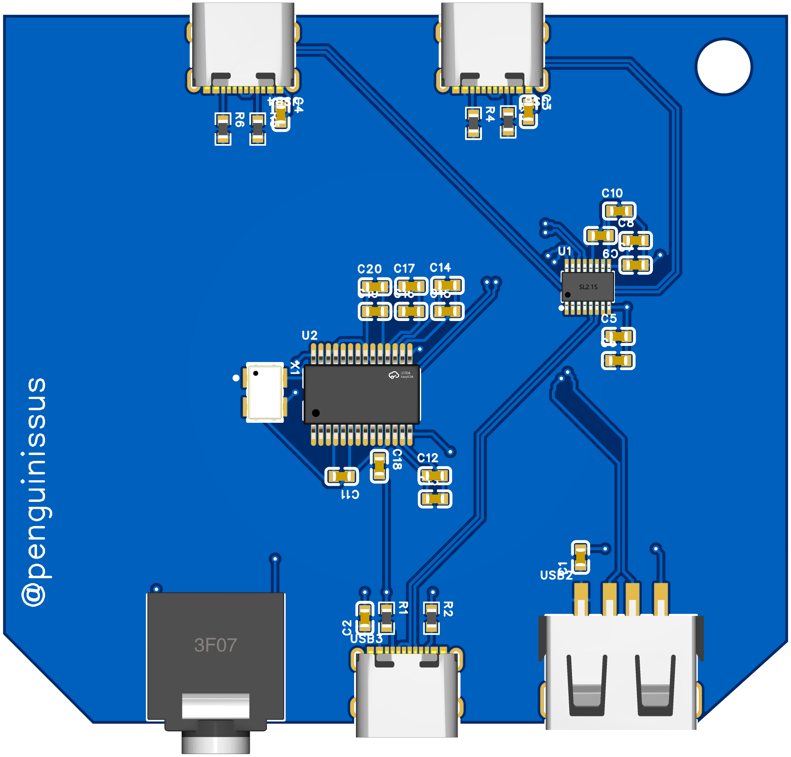
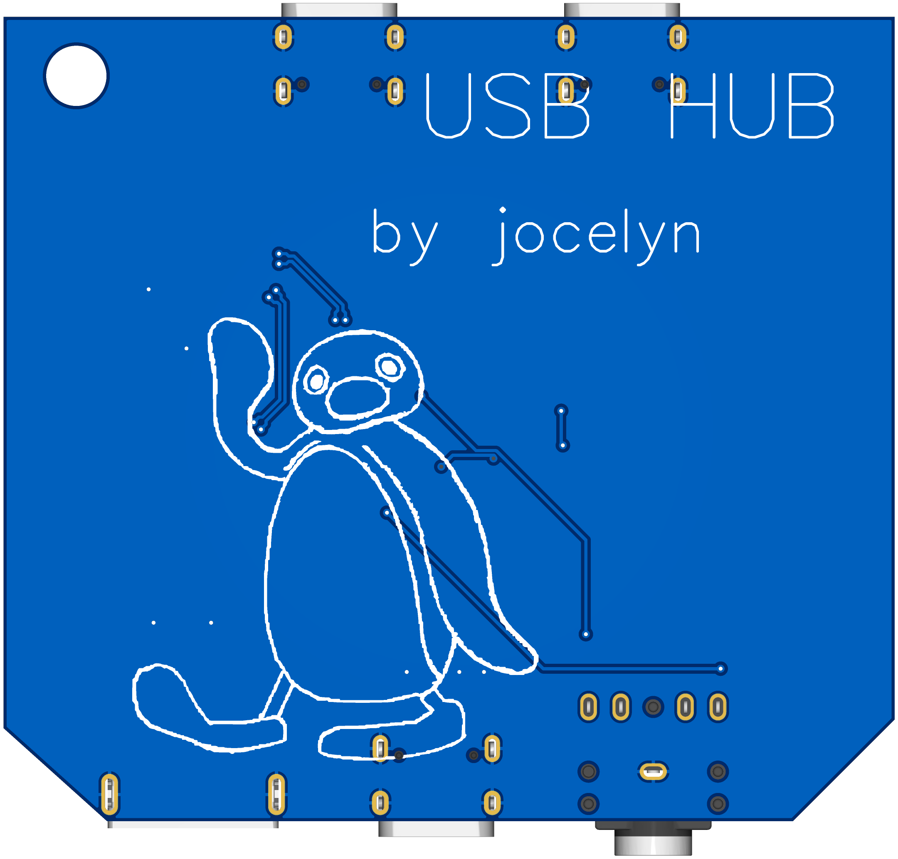

# Phone Dongle
A USB hub with a headphone jack (so important) that also doubles as a keychain.   

# Features
1 upstream USB-C port splits into:  
2 USB-C ports  
1 USB-A port  
1 Headphone jack      

# Why I made this
Companies keep shrinking their devices and cutting off ports, so I wanted to make a USB hub. Music lovers all understand the frustration when phones didn't come with headphone jacks anymore, and usb c headphones don't provide a good listening experience, so I decided to add a headphone jack as a special feature to my usb hub.    

# Images
schematic  
  
pcb editor  
  
pcb front view  
  
pcb back view  
  

# Resources
The usb hub guide on fallout